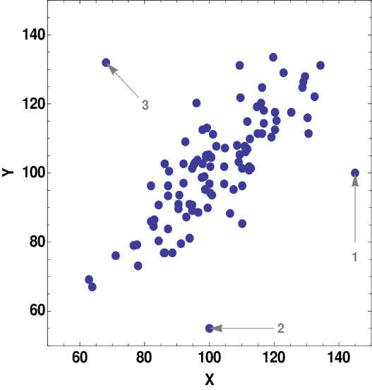
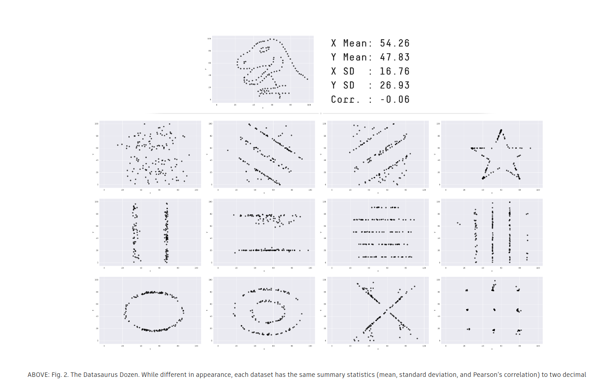
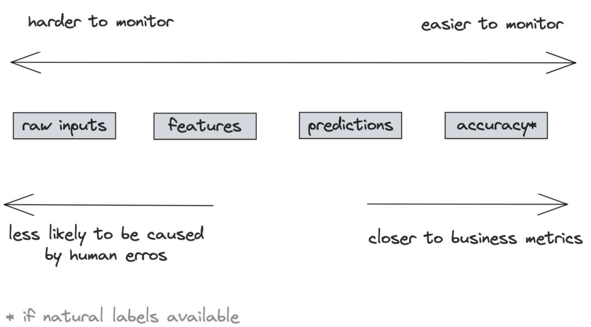

# Model diagnostics and monitoring
Goals:
  * Discover types of ML failures
  * Explore tools to discover and analyse ML failures

## ML failures
There exist two types of failures:
1. Operational failure (for all apps)
    `404 not found`, high avg latency, limited throughput
2. **ML failture**
    Bad scores: accuracy, F1, BLEU, etc.

### Reasons
1. Production data vs Training data
    1. *Train-serving skew* 
         Model performs badly on any production data
    2. *Data distribution shifts*
        Data patters change over time
2. Edge cases
    1. *Outliers*
    2. *Edge case* 
   
3. Degenerate feedback loops
    Bad choice of collecting feedback for further training. **Hard to detect and fix.**
    * Detection
      * *ARP* -- avg popularity of the recommended items
      * *APLT* -- avg % of long tail items being recommended
      * *Hit rate vs popularity* -- acc based on item's popularity
    * Mitigation
      * Randomization -- 
      * Positional features -- features based on object's position
        
### Data Distribution Shifts
One of the ways to represent task of *supervised learning* is via *probability f-ns*:
* Original data distributino: $P(X)$
* Labels distribution: $P(Y)$
* True function: $P(Y|X)$
* Scoring function: $P(X, Y)$ ([joint probability](https://en.wikipedia.org/wiki/Joint_probability_distribution)).
* The resulting problem: $P(Y|X) = arg \min_{P(Y|X)} P(X,Y)$
Note, that: 
$$P(X,Y) = P(Y|X)P(X) = P(X|Y)P(Y)$$

#### Covariance shift
**$P(X)$ changes, $P(Y|X)$ -- same.**
> Example: cancer prediction.
> Predicting $P(\text{cancer } | \text{age})$
> Here, covariance shift means that:
>  * P(age) changed (ex. young people started to ask for service more often)
>  * P(cancer|patient) stayed the same (German wealthy man at his 40-s still has the same probability to have a cancer)

Causes:
  * Data collection -- sampling biases
  * Learning techniques -- [active learning](https://en.wikipedia.org/wiki/Active_learning_(machine_learning))
  * Change of environment

Mitigation:
    Use [importance weighting](https://arxiv.org/abs/2006.04662) while training (if changes in prod vs train data is known in advance).

#### Label shift
**P(Y) changes, P(X|Y) -- same**
Usually, **Covariance shift often infers label shift (but not vice versa!)**
> For the same example, label shift means that:
> * P(cancer) changed (new preventive drug was invented)
> * P(age|cancer) stays the same (the older people still more lickely to become sick)

Causes: the same
Mitigation: the same (?)

#### Concept drift
**P(X) -- same, P(Y|X) changes**
> For the same example, concept drift means that:
> * P(X) stays the same (still the same category refers for the treatment)
> * P(Y|X) changes (people are more likely to fall sick during COVID-19)

Types of shifts:
    * *Suddent shift* vs *gradual shift*
    * *Spatial shift* vs *temporal shift*

Detection:
  * Statistict comparison: mean, median, variance, etc.
    If statistics differ, the distribution differ, *but not vice-versa*!
        
  * Two-sample hypothesis test
    Determine whether difference between two populations (ex. data from yesterday and today) significant or not.
    Examples:
    *  [KS test (*Kolmogorov-Smirnov*)](https://en.wikipedia.org/wiki/Kolmogorov%E2%80%93Smirnov_test)
        Works only with 1 dimentional data => *useful for predictions & label distribution*
    *  Other tests could be found [here](https://github.com/SeldonIO/alibi-detect)
    All two-sample tests work better on low-dim data, so consider dimention reduction first.

Mitigation:
  * Expand training dataset
  * Retrain model with new distribution

## Monitoring
It's important to differentiate:
1. **Monitoring** -- collecting different metrics to determing *when something goes wrong*
2. **Observability** -- setting up a system in a way that helps to determine **what went wrong**.

Instruments for *observability* are:
1. Adding timers to functions
2. Counting NaNs in features
3. Logging unusual events (ex. outliers)

Instruments for *monitoring* are:
1. Operational metrics
    Latency, throughput, Requests per unit time, CPU/GPU usage etc.
3. ML-specific metrics
    
### ML-specific metrics

1. Accuracy metrics. 
    Feedback required
2. Predictions metrics
    Change in preds distribution implies change in input data
3. Features metrics
    *Most monitoring is focused on.* The evaluation is based on schema expectations. 
    > Examples of expectations:
    > * min, max, median are in [a, b]
    > * FEATURE_1 > FEATURE_2
    > * Categorical data belongs to a predefined class
    Problems:
    * Computational cost
    * Alert Fatigue -- too many alers appearing
    * Schema management -- finding a way to map features to schema versions

### Monitoring toolbox
The main tools are:
1. Dashboards (TensorBoard, etc.)
    Visual, but not sufficient for deep analysis
2. Alerts
    Main components: alert policy, notification channels, and description

## Data preprocessing
### Handling missing values
Types of missing values:
1. Missing not at random
2. Missing at random
3. Missing completely at random

Handling options:
1. Deletion (columns or rows)
2. Imputation (default, or statistical measures)

### Scaling
Types of scaling
1. *Min-max*. Any use case
2. [*Z-score*](https://developers.google.com/machine-learning/data-prep/transform/normalization#:~:text=Z%2Dscore%20is%20a%20variation,extreme%20that%20you%20need%20clipping.). When variables follow normal distribution 
3. *log*. When variables follow an exponential distribution
Scaling is a common source of data leakage

### Discretization
Continuous -> discrete

Usually -- *range buckets* (ex. age groups)

### Encodign categorical features
One-hot encoding is the choice!
