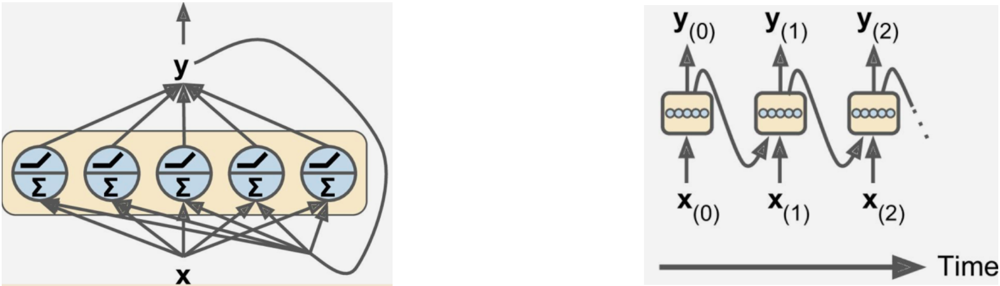
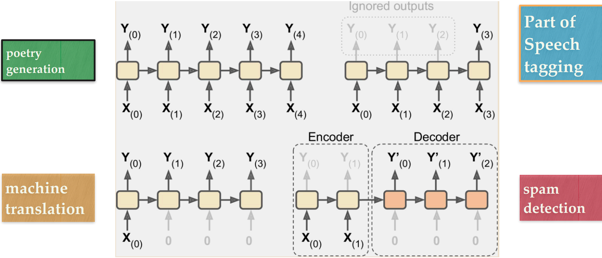
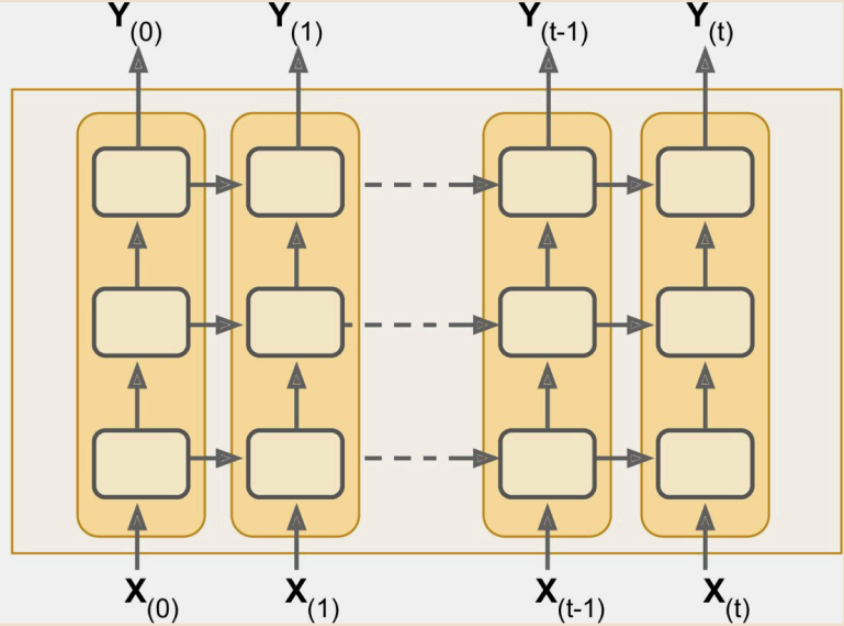
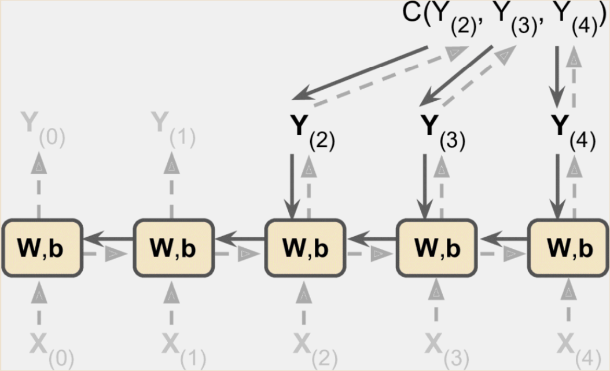
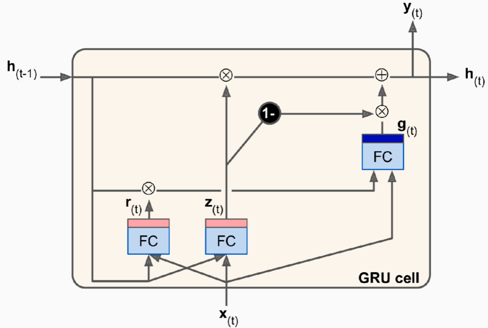
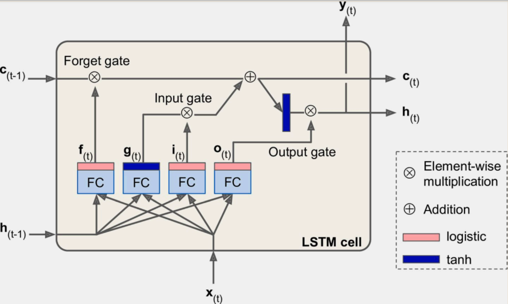
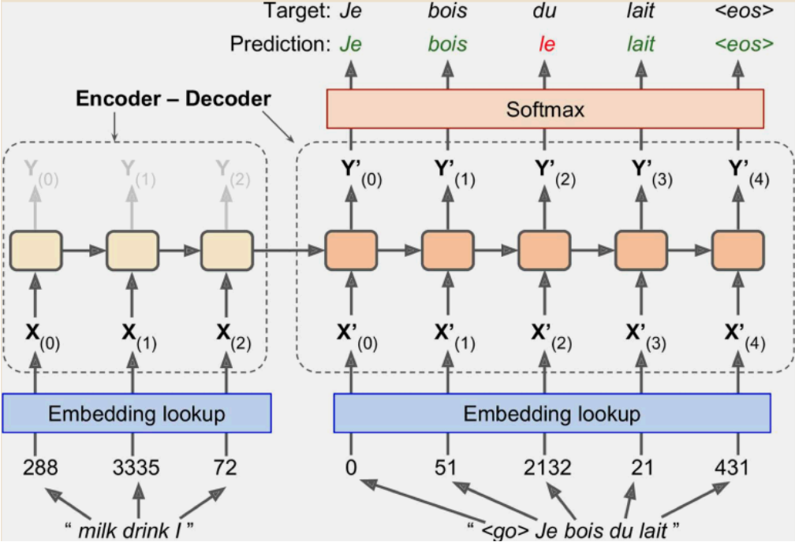
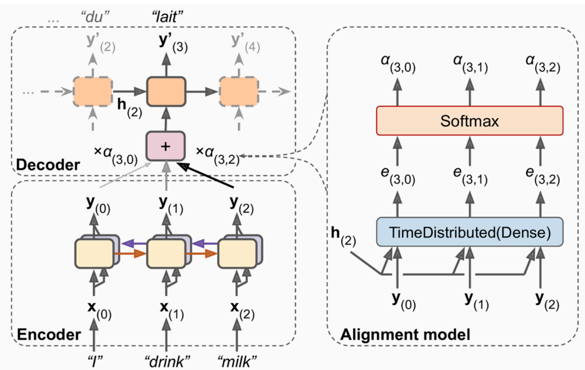
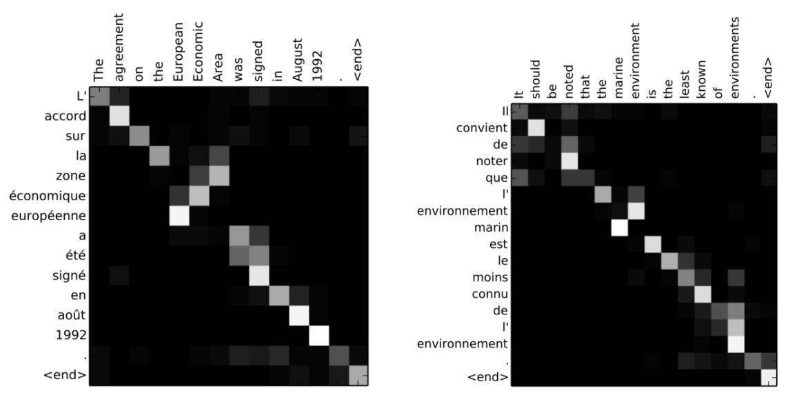

# Recursive Neural Networks (RNN)

## Basic Information
The RNN are used in:
1. Time Series Predictions
2. Sequence Processing
3. Generation of Sequences (text, music)

The concept: use for prediction not only the current measurement
$y = \sigma(W_x x + b)$
but also incorporate **data from previous samples** (output or inner state):
$y = \sigma(W_x x + W_y y_{t-1} + b)$

This inheritance forms kind of memory for the cell. That's why it's called **memory cell**.

There are many ways to interpred inputs and outputs of RNNs.

    

## Deep RNNs
The concept is very simple: stack many RNNs on each other in one layer

    

The back propogation for RNNs is called **back propogation through time (BPTT)**.
THe loss funciton is applied for *all outputs* and then propogated back both from *output and from inner state*.

    

## Different of RNN cells
The problem of naive DRNN are:
1. *Vanishing/exploiding gradients*. Solution -- *LayerNormalization*
2. The memory of the first input gradually fades away. Solution: another types of cells.

### GRU cell
**Structure**

    

or, mathematically:

$$z = \sigma(W_{xz} x + W_{hz} h_{t-1} + b_z)$$
$$r = \sigma(W_{xr} x + W_{hr} h_{t-1} + b_r)$$
$$g = tanh \left(W_{xg} x + W_{hg} (r \otimes h_{t-1}) + b_g \right)$$
$$y = h_t = z \otimes h_{t-1} + (1-z) \otimes g$$
where $\sigma(x)$ is a sigmoid activation function, $\otimes$ is a tensor product.

**Idea**
The GRU consists of two parts: one is responsible for updating the output (variable $z$), and another for *resseting unrelevant featuers* (variable $r$). Both of them are combined in another FC layer (variable $g$) and output is generated.

**Pros and Cons**
+ Faster than LSTM
- Slightly worse results on the benchmarks

### LSTM
**Structure**

    

or, mathematically:

$$f_t = \sigma(W_{xf} x_t + W_{hf} h_{t-1} + b_f)$$
$$g_t = tanh(W_{xg} x_t + W_{hg} h_{t-1} + b_g)$$
$$i_t = \sigma(W_{xi} x_t + W_{hi} h_{t-1} + b_i)$$
$$o_t = \sigma(W_{xo} x_t + W_{ho} h_{t-1} + b_o)$$
$$c_t = f_t \otimes c_{t-1} + i_t \otimes g_t$$
$$y_t = h_t = o_t \otimes tanh(c_t)$$

**Idea**
First of all, apart from $y$ and $h$, LSTM passes *vector $c$ -- filter for output gate*. The body consists of several parts:
1. *Forget gate.* Updates the filter based on $f_t$.
2. *Input gate.* Processes the input of the system and applies filter $c_t$ to it.
3. *Output gate.* Constructs the output based on raw predictions from the $o$ and filtered activated input.

**Pros and Cons**
+ More accurate and flexible
- Slower and more complex

## Encoders and Decoders
They appear in **sequence to sequence generation**. Hence, one need to introduce **encoder-decoder framework**.

    

Notes:
1. Inpus sequence is *reversed* to correspond to output order.
2. The hidden side of decoder is *the same* as incoder's one.
3. Put *special token at the beginning* of the encoder input.

## [Attention](https://jalammar.github.io/visualizing-neural-machine-translation-mechanics-of-seq2seq-models-with-attention/)
Motivation: *the distance* between tokens in seq2seq generation is *too big*.

**Architecture**

    

**Meaning**
The main feature of attention-based RNNs is save all the hidden states from incoder, postprocess them and use the most relevant of them to generate given output in the decoder.

This results in a better understanding of a context and how words combine with each other.

    

Other types of attention:
1. *Luong attention.* Measures a similarity of several previous elements by a simple dot product
2. *Visual attention.* After applying CNN, the RNN with attention could summarize the picture by highlighting specific parts of the image
