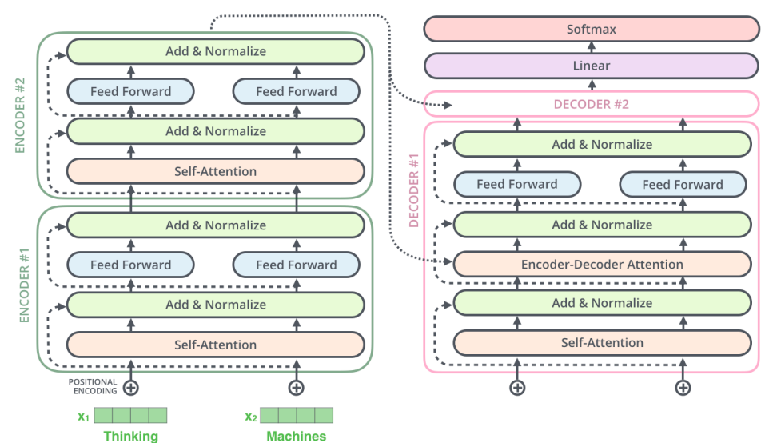
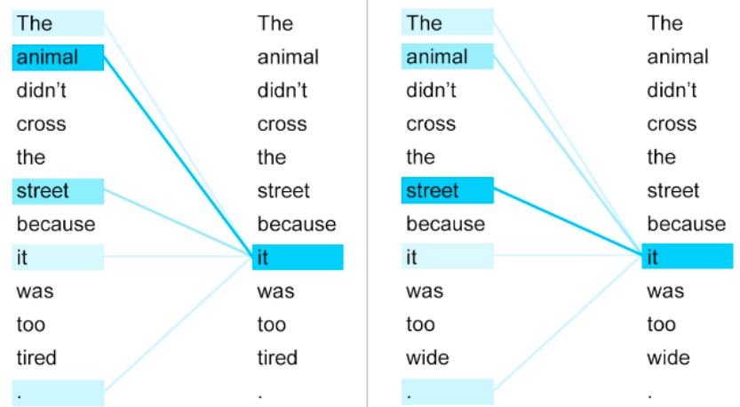
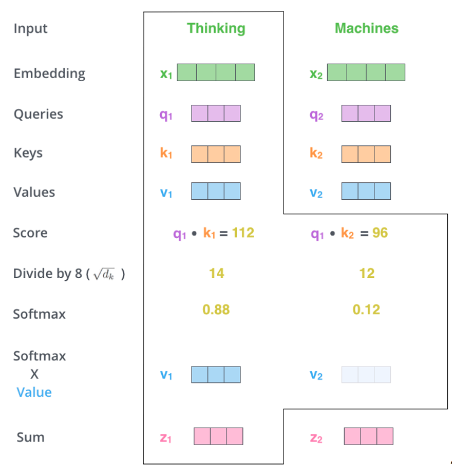
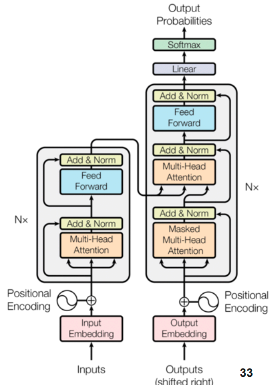
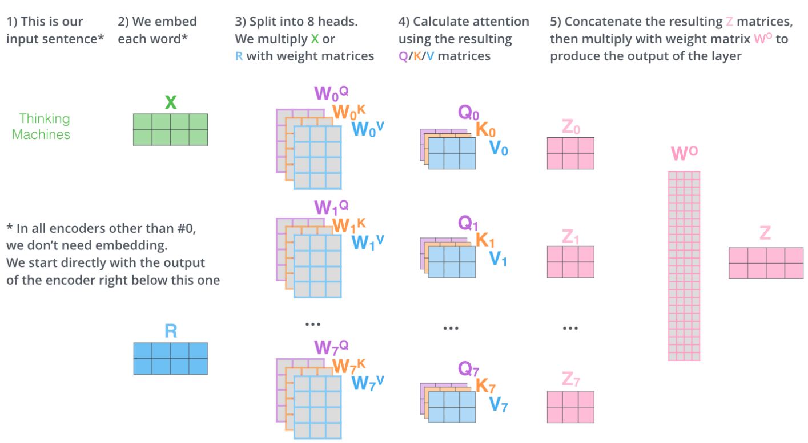
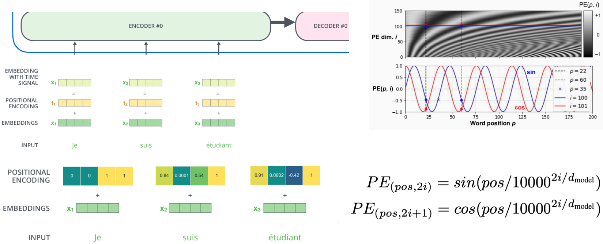
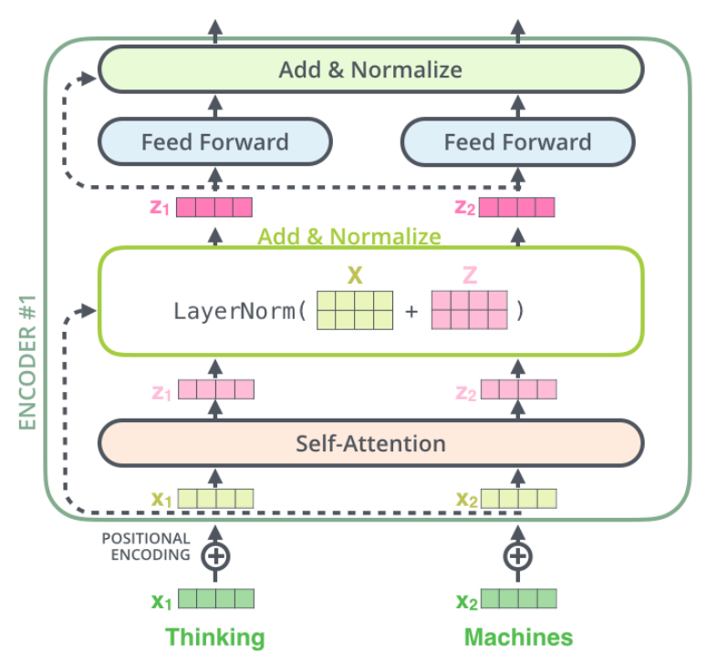

# Transformer

## General view
Problem with sequential procesing: 
1. *Long-distance dependencies*. They are available only after reading the whole sequence
2. *Sequential processing of RNNs*. No parallelism
   
**Solution: transformer, build solely on attention** (without RNN or FC)

The general structure is the same as for RNN. However, in transformer all encoders are the inputs to all decoders.

    

Important notes:
1. The output of encoder has *the same dimension* as an input
2. All feed-forward layers shares *the same matrix*.
3. The decoder has the similar structure as encoder, but with *enc-dec attention calculated based on the encoders output*
4. Everything starts with *positional encoding* (since all the sequence is processed at once).

## Self-Attention
Basically, **self-attention processes different positions of the same sequence** to make an appropriate representation of the sequence.

> *Example.* consider two sentences:
> 1. *The animal didn’t cross the street because it was too wide*
> 2. *The animal didn’t cross the street because it was too tired*
>
> Need to detect words, which relates to word *it*:
> 1. *The animal didn’t cross the <u>street</u> because it was too <u>wide</u>*
> 2. *The <u>animal</u> didn’t cross the street because it was too <u>tired</u>*
> 
> 
> 
> The task of self-attention is to detect this relations.

This layer performs this way *for each embedding*:
1. First, we are intoducing three metrics: *Queries $q$, Keys $k$, and Values $v$* -- abstractions for the attention. *They are computed for all inputs in advance*.
2. Then scores are computed: $q \cdot k_i$ and normalized by some factor. *Note: $q$ belongs to current input, $k$ are taken from all inputs*.
3. Then this mask is applied and activated by SoftMax.
4. Resulted values for all the outputs are summed.

    

### Mathematics of self-attention
Let's consider an input $X \in \mathbb{R}^{n_w \times n_e}$, where $n_w$ -- no. of words, and $n_e$ -- dimension of encoder vectors.

Then, queries, keys and values *for all layers* are computed as:

$$Q = XW^Q;\quad K = XW^K;\quad V=XW^V$$

Then, attentions for all layers are:
$$Attention(Q, K, V) = Softmax \left(\frac{QK^T}{\sqrt{d_k}}\right)V,$$
where $d_k$ is scaling factor.

### Application in transformers

    

**Multi-headed attention**
$Q = K = V$, and they come from the encoder

**Encoder-decoder attention**
$Q$ comes from the output decoder, $K = V$ comes from encoder

**In masked Multi-Head attention**
$Q = K = V$, and they come from the decoder.

*Masking* is a matrix of zeros and ones, which is applied to *scores* $QK^T$. This is used to prevent *data leakage*.

### Multi-head attention
The idea is *to calculate multiple attentions* and concatenate them. Then, their sum is calculated as previously

    

## Other layers of transformer
**Positional encoding**
Goal: get some information about relative/absolute position of tokens
Solution:
$PE_{pos, 2i} = sin(pos / 10^{10i/d_{model}})$
$PE_{pos, 2i+1} = cos(pos / 10^{10i/d_{model}})$

    

**Layer Normalization**

    

